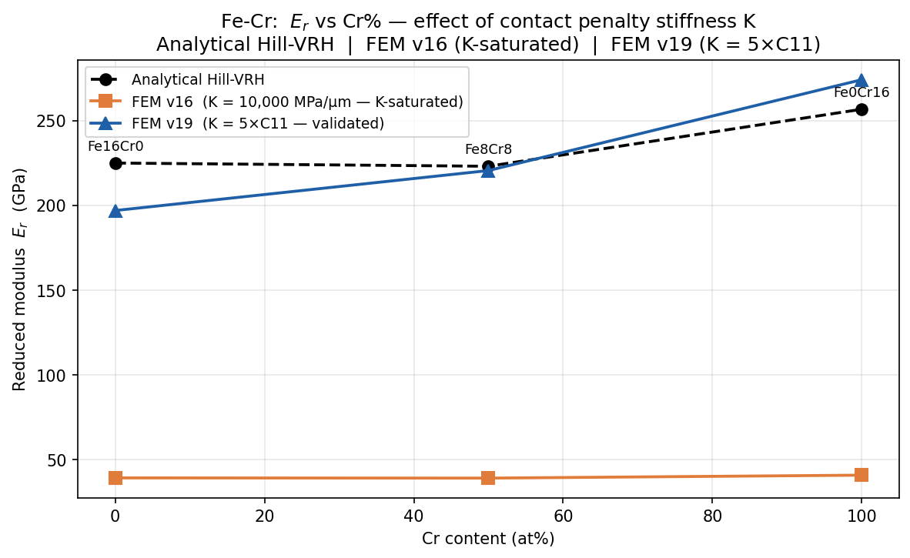
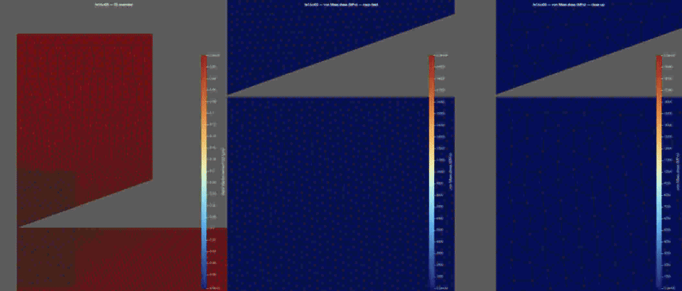

# Elastic Constants of Binary Alloys — DFT → ML Surrogate → FEM

A full computational pipeline for Fe-Cr binary alloys: DFT elastic-constant
computation across 17 compositions, Gaussian-Process and MLP surrogate-model
training, and CalculiX FEM nanoindentation simulations that extract the reduced
indentation modulus *E*ᵣ as a function of Cr content. Each stage carries its own
explicit post-processing step, documented below.

Cu-Ni (FCC, 32-atom supercell) is scaffolded in the codebase but deferred — all
scripts contain commented-out Cu-Ni blocks preserved for future use.

---

## Table of contents

1. [Pipeline overview](#pipeline-overview)
2. [Repository structure](#repository-structure)
3. [System and compute](#system-and-compute)
4. [Stage 1 — DFT elastic constants](#stage-1--dft-elastic-constants)
5. [Stage 2 — ML surrogate](#stage-2--ml-surrogate)
6. [Stage 3 — FEM nanoindentation](#stage-3--fem-nanoindentation)
7. [Results](#results)
8. [Field animations](#field-animations)
9. [Known limitations](#known-limitations)
10. [Reproducing the results](#reproducing-the-results)
11. [Implementation notes](#implementation-notes)

---

## Pipeline overview

```
   STAGE 1 — DFT                 STAGE 2 — ML surrogate          STAGE 3 — FEM
   ─────────────                 ──────────────────────          ─────────────
   strain–stress method    →     GP + MLP across Cr%       →     axisymmetric
   16-atom BCC supercell         interpolated C11,C12,C44        conical indentation
                                                                  Oliver–Pharr → Er
   ── post-processing ──         ── post-processing ──           ── post-processing ──
   stress-tensor extraction      LOO-CV, ablation,               ×180 wedge scaling,
   convergence-tier audit        material-card generation        O–P fit, K-diagnostic,
                                                                  ParaView field viz
```

Every stage is independently runnable and consumes the previous stage's artefacts
through documented file interfaces. The post-processing step of each stage
converts raw solver output into the validated artefact the next stage depends on.

---

## Repository structure

```
.
├── scripts/
│   ├── run_elastic_grid.sh         # DFT sweep: Fe-Cr (BCC, 16-atom supercell)
│   └── run_elastic_grid_afm.sh     # AFM-initialised variant for high-Cr tags
├── dft_data/                       # Extracted stress tensors (.dat per tag per strain)
├── outputs/                        # Raw QE .out files
├── pseudo/                         # UPF pseudopotential files
├── ml/
│   ├── gp_scratch.py               # GP: Matérn-5/2 kernel, Cholesky, L-BFGS-B
│   ├── data_utils.py               # Shared loader, LOO-CV, metrics, tier/flag arrays
│   ├── enrich_csv.py               # Produces raw + uncertainty-corrected CSVs
│   ├── 01_gp_surrogate.ipynb       # GP training across both datasets and all tiers
│   ├── 03_mlp.ipynb                # MLP training, numpy Adam, bootstrap uncertainty
│   ├── 04_model_comparison.ipynb   # GP vs MLP comparison, FEM material card generation
│   └── 05_ablation_fe02cr14.ipynb  # fe02cr14 removal study
├── analysis/                       # Derived outputs: CSVs, PKLs, figures, material cards
├── notebooks/
│   └── fecr_nanoindentation_analysis_v19_all.ipynb   # Oliver-Pharr, all compositions
├── fem/
│   ├── conical/
│   │   ├── fe16cr00/               # CCX input, dat, frd, vtkhdf — Fe16Cr0
│   │   ├── fe08cr08/               # Fe8Cr8
│   │   ├── fe04cr12/               # Fe4Cr12
│   │   └── fe00cr16/               # Fe0Cr16
│   └── post/                       # FEM post-processing scripts + figures
│       ├── 01_convert_frd.py
│       ├── 01b_consolidate_vtkhdf.py
│       ├── 02_scan_global_ranges.py
│       ├── 03_render_outputs.py
│       ├── contact_pressure_plot.py
│       ├── fecr_Er_K_dependency.png
│       └── paraview_figures/
│           ├── v1/                 # single-panel renders (legacy)
│           └── v3/                 # three-panel renders (current)
├── results/
└── fe02cr14/                       # Isolated directory for the mixed-tier tag
```

---

## System and compute

| Item | Details |
|---|---|
| DFT code | Quantum ESPRESSO 7.3.1 (`pw.x`), GPU-accelerated |
| DFT compute | Vast.ai RTX 4090 (NVHPC 24.7, CUDA 12.5, cc=89) |
| FEM code | CalculiX CCX 2.21 |
| FEM compute | CloudHPC (browser-based), local WSL for restarts |
| Visualisation | ParaView 6.1.1 (Kitware tarball, MPI build, Python 3.12) |
| Local machine | Ubuntu WSL2 (Azog), Python 3.12 |

---

## Stage 1 — DFT elastic constants

**System:** Fe-Cr BCC, 16-atom supercell, 17 compositions (Fe16Cr0 → Fe0Cr16 in
steps of 1 atom), 10 strain calculations per composition = 170 total QE
calculations.

**Method:** Three independent strain types per composition — hydrostatic,
volume-conserving tetragonal, and shear — each at ±ε amplitudes. Elastic constants
are extracted from the stress tensor:

- `C11 + 2·C12` from hydrostatic strain
- `C11 − C12` from volume-conserving tetragonal strain, denominator `3ε`
- `C44` from shear strain, `(σ[−ε] − σ[+ε]) / 4ε`

**Convergence settings by tier:**

| Tags | conv_thr | Magnetic initialisation |
|---|---|---|
| fe16cr00 – fe08cr08 | 1×10⁻⁸ | FM |
| fe07cr09 – fe03cr13 | 1×10⁻⁷ | FM |
| fe02cr14 | mixed 1×10⁻⁷ / 1×10⁻⁵ | mixed FM / AFM |
| fe01cr15, fe00cr16 | 1×10⁻⁵ | AFM sublattice |

**AFM treatment:** High-Cr tags (fe02cr14, fe01cr15, fe00cr16) use
`run_elastic_grid_afm.sh` with 3 atom types (Fe, CrA, CrB), BCC sublattice parity
splitting, and `starting_magnetization` values of +0.5 / +0.5 / −0.5. FM
initialisation is physically indefensible at ≥87 % Cr — the system crosses the AFM
phase boundary and FM SCF oscillates between competing spin states regardless of
numerical settings. The AFM initialisation is therefore the **correct physics** for
these tags, not a source of error; the residual uncertainty for high-Cr tags comes
from the relaxed convergence threshold (1×10⁻⁵), not from the magnetic treatment.

### Post-processing — Stage 1

- **Stress-tensor extraction.** The pipeline parses the stress tensor directly from
  each QE output rather than relying on the `JOB DONE` string, which QE prints even
  after `convergence NOT achieved`.
- **Elastic-constant solve.** C11, C12, and C44 are solved from the three strain
  families using the sign and denominator conventions above.
- **Convergence-tier classification.** Each tag is assigned a quality tier
  (conv_thr level, magnetic treatment, vc-relax status), which is carried forward
  into the ML training weights.
- **Per-calculation uncertainty audit.** A per-calculation noise estimate is
  produced (`per_calc_uncertainty.csv`) for the uncertainty-corrected dataset.

**Known data-quality issues:**

- `fe09cr07`: post-vc-relax final SCF did not converge; geometry uncertainty
  propagates to all strain calculations for this tag.
- `fe02cr14`: mixed convergence tiers and mixed magnetic initialisation across its
  strain calculations. Subject of a dedicated ablation study
  (`05_ablation_fe02cr14.ipynb`).

---

## Stage 2 — ML surrogate

**Models:** Gaussian Process (GP) and MLP. XGBoost was implemented and evaluated
but excluded from final results — N = 17 is insufficient for reliable gradient
boosting.

**Datasets:** Two variants:

- `raw`: uniform noise σ = 1.0 GPa per calculation (baseline)
- `corrected`: per-constant empirical noise from a per-calculation uncertainty
  audit (`per_calc_uncertainty.csv`)

Uncertainty sources are combined via direct addition, not quadrature. Each elastic
constant (C11+2C12, C11−C12, C44) has its own noise column.

**Five-tier data-quality classification:**

| Tier | Tags | Basis |
|---|---|---|
| A | fe16cr00 – fe08cr08 | conv_thr 1×10⁻⁸, FM, clean vc-relax |
| B | fe07cr09 – fe03cr13 | conv_thr 1×10⁻⁷ |
| C | fe02cr14 – fe00cr16 | conv_thr 1×10⁻⁵, AFM initialisation |
| D | fe09cr07, fe02cr14 | post-vc-relax SCF non-convergence |
| E | selected tags | cubic enforcement residual (b/a ≠ 1) |

AFM-tier tags (C) enter the training set with lower sample weights and are flagged.
Non-converged FM outputs for fe02cr14, fe01cr15, and fe00cr16 are retained as
diagnostics only and never enter training.

### Post-processing — Stage 2

- **Leave-one-out cross-validation** across both datasets and all tiers, MAE as the
  primary metric with R² as a sanity check.
- **GP-vs-MLP model comparison** (`04_model_comparison.ipynb`) selecting the best
  surrogate per elastic constant.
- **Ablation study** (`05_ablation_fe02cr14.ipynb`) quantifying the effect of
  removing the mixed-tier tag.
- **Material-card generation** — the selected surrogates emit FEM-ready cards in
  both CalculiX and ABAQUS format, in MPa.
- **Uncertainty propagation** — GP posterior standard deviation is carried as the
  per-prediction uncertainty bound.

**Best models (MAE primary, R² sanity check):**

- C11, C12: MLP raw, fe02cr14 ablated
- C44: MLP raw, full dataset
- Uncertainty bounds: GP posterior standard deviation

**Key outputs in `analysis/`:**

- `elastic_constants_fecr_raw.csv`, `elastic_constants_fecr_corrected.csv`
- `fem_material_inputs_best.csv` — MLP mean values with GP std, in GPa
- `calculix_material_cards_best.inp` — `*ELASTIC, TYPE=ANISO` cards in MPa
- `abaqus_material_cards_best.inp` — `*Elastic, type=ANISOTROPIC` cards in MPa
- All GP and MLP models as `.pkl` files (4 variants each: raw/corrected × full/ablated)

---

## Stage 3 — FEM nanoindentation

**Setup:**

| Parameter | Value |
|---|---|
| Code | CalculiX CCX 2.21 |
| Element type | CAX6 (axisymmetric) |
| Contact formulation | SURFACE TO SURFACE, penalty |
| Indenter geometry | Conical, 70.3° half-angle from the axis |
| Indenter material | Diamond: E = 1,141,000 MPa, ν = 0.07 |
| Units | µm / µN / MPa throughout |
| Target indentation depth | h_max ≈ 0.404 µm |
| Unloading | to 90 % of h_max |

**Compositions:** Fe16Cr0, Fe8Cr8, Fe4Cr12, Fe0Cr16.

**Contact geometry.** For a cone of half-angle α measured from the indentation
axis, the projected contact radius at depth *h* is `a = h · tan(α) = 0.404 ·
tan(70.3°) = 1.128 µm`.

### Contact penalty stiffness — the central parameter

The penalty stiffness K controls whether the FEM produces physically meaningful
forces. Two runs were performed across all compositions to demonstrate the
K-dependency.

**v16 (K = 10,000 MPa/µm — K-saturated, physically invalid):** All four
compositions ran to completion. Post-run analysis revealed that the mean contact
pressure at peak load (~40 GPa) matched the penalty ceiling K × h_element, meaning
the substrate elastic constants never entered the force response. The *E*ᵣ values
were flat across all compositions at ~40 GPa regardless of material — a direct
consequence of K-saturation, not material behaviour. The P-h curves converged
cleanly with no solver warnings; the saturation is silent and can only be detected
by checking the contact pressure against K × h_element.

**v19 (K = 5×C11 per composition — validated):** K is derived from the CCX manual
lower bound (K = 5–50 × C11). σ∞ = 0.25 % × C11. K = 15×C11 was attempted first but
caused contact oscillation and was abandoned. v19 ran to completion for all four
compositions and produced physically valid Oliver-Pharr results.

| Composition | C11 (MPa) | K = 5×C11 (MPa/µm) | σ∞ (MPa) |
|---|---|---|---|
| Fe16Cr0 | 307,430 | 1,537,150 | 769 |
| Fe8Cr8 | 300,500 | 1,502,500 | 751 |
| Fe4Cr12 | 396,510 | 1,982,550 | 991 |
| Fe0Cr16 | 438,290 | 2,191,450 | 1,096 |

### Post-processing — Stage 3

Stage 3 post-processing has two parts: **quantitative** (Oliver-Pharr modulus
extraction) and **qualitative** (ParaView field visualisation).

#### 3a. Oliver-Pharr extraction and corrections

1. **Axisymmetric wedge force scaling (×180).** CalculiX expands CAX elements into
   a fixed 2° sector. The reaction force in the `.dat` file is for that sector, not
   the full 360°. Physical force = reported force × (360/2) = ×180. Without this
   correction the modulus is ~180× too low.

2. **Exclusion of zero-contact unloading points.** At K = 5×C11 (lower bound), the
   surface recovers faster than the indenter retracts during unloading, causing
   contact separation before the prescribed displacement is complete. Points where
   P = 0 are excluded from the Oliver-Pharr fit — they represent free-space travel,
   not elastic unloading mechanics. These points are marked explicitly on the P-h
   plots.

3. **Diamond-indenter compliance correction.**
   `1/Eᵣ_sample = 1/Eᵣ − (1−νᵢ²)/Eᵢ`, applied after the ×180 scaling and
   zero-contact exclusion.

The K-dependency figure (`fem/post/fecr_Er_K_dependency.png`) shows v16 *E*ᵣ values
flat at ~40 GPa for all compositions (K-saturation artefact) versus v19 values
tracking the analytical Hill-VRH curve within −12 % to +7 %.



#### 3b. Field visualisation pipeline (ParaView)

Each `.frd` is converted to `.vtkhdf` and rendered in ParaView 6.1.1. The renderer
produces, per composition, a **three-panel composite** for four fields — axial
displacement (U2), von Mises stress, axial stress (SYY), and axial strain (EYY):

| Panel | Camera (parallel scale) | Window | Purpose |
|---|---|---|---|
| Overview | full model | whole domain | indenter motion through the load–unload cycle |
| Near-field | 1.5 | ~3 µm | full contact patch (a = 1.128 µm) and its decay |
| Close-up | 0.6 | ~1.2 µm | sub-contact detail of the 0.4 µm indentation |

Three key frames are defined directly from the reaction-force record:

- **first_contact** — first increment where the contact springs activate
  (`|RF2| > 0.5 µN`)
- **peak** — last increment of step 4 (h = 0.404 µm, maximum load)
- **last_contact** — last increment before the reaction force returns to zero
  (contact springs separate during unloading)

**Colorbar caps.** For von Mises and SYY stress, per-composition colorbar limits are
set from the mean contact pressure, `p_mean = (RF2 × 180) / (π a²)`, rather than the
automatic data range. The raw nodal stress range is dominated by **penalty contact
edge singularities** — nodes at the active/inactive contact boundary where the peak
Mises stress exceeds C11 by roughly an order of magnitude, which is physically
impossible in a linear-elastic material and therefore numerical in origin. Capping
at ~1.5–2.6 × *p_mean* reveals the physical stress field while letting the
singularity nodes saturate. U2 and EYY use automatic ranges, as their global extrema
are physically defensible. These caps affect **visualisation only** — the
Oliver-Pharr moduli derive from the integrated force–displacement curve and are
unaffected by nodal-stress artefacts.

| Field | Colorbar source | Note |
|---|---|---|
| U2 | automatic | smooth kinematic field, no artefacts |
| von Mises | capped, per composition (0 → 15–25 kMPa) | reveals contact bulb |
| SYY | capped, per composition (±12–20 kMPa) | tensile islands = edge singularities |
| EYY | automatic | element-boundary streaks are mesh-structural |

**Visualisation evolution (v1 → v3).** The renderer went through three documented
iterations, retained in the repository for provenance:

- **v1** — single zoom panel, automatic colorbar. The automatic range was dominated
  by singularity nodes (Mises up to ~9.3×10⁶ MPa from the global-range scan), which
  compressed the physical field into the bottom fraction of the colorbar and made
  every timestep look identical. The camera was also framed on the full substrate,
  so the contact zone was invisible.
- **v2** — corrected camera onto the contact zone and introduced colorbar caps from
  *p_mean*. This revealed the physical stress field but used a single zoom level; at
  the close-up scale the full contact patch and its decay were partly out of frame.
- **v3 (current)** — three-panel composite (overview ∣ near-field ∣ close-up) and
  per-composition caps derived from the material cards. The near-field panel
  captures the full contact patch and its decay; the close-up resolves the
  sub-contact detail of the 0.4 µm indentation. Cameras and caps are no longer
  changed between fields except for the documented per-composition stress caps.

Scripts (run with `pvpython` unless noted):

| Script | Purpose |
|---|---|
| `01_convert_frd.py` | `.frd` → per-increment `.vtu` + `.pvd` |
| `01b_consolidate_vtkhdf.py` | `.vtu` + `.pvd` → single `.vtkhdf` per composition |
| `02_scan_global_ranges.py` | global field min/max scan (diagnostic) |
| `03_render_outputs.py` | three-panel static PNGs + `.ogv` animations |
| `contact_pressure_plot.py` | P/A_c(t) curve from `.dat` (`python3`, no ParaView) |

---

## Results

### Analytical Eᵣ — Hill VRH (primary analytical reference)

Hill VRH averaging of the ML-predicted elastic constants to an
equivalent-isotropic indentation modulus, with diamond-indenter compliance
correction. Validated against pure Fe BCC: computed 229.5 GPa vs literature
~230 GPa (~0.4 % error). The Barnett-Lothe/Stroh orientation-specific path was
implemented and evaluated but failed validation on Cu and is excluded.

| Composition | Cr (at%) | E_VRH (GPa) | ν_VRH | Eᵣ (GPa) |
|---|---|---|---|---|
| Fe16Cr0 | 0 | 255.0 | 0.297 | 224.9 |
| Fe8Cr8 | 50 | 252.3 | 0.300 | 223.0 |
| Fe4Cr12 | 75 | 295.7 | 0.302 | 257.3 |
| Fe0Cr16 | 100 | 315.1 | 0.224 | 256.6 |

The slight dip at Fe8Cr8 relative to Fe16Cr0 is attributed to the C44 contribution
to G_VRH. The rise at high Cr is driven by increasing C11 combined with the
anomalously low C12 (66 GPa) in Fe0Cr16, which reflects the AFM ground state of
near-pure Cr.

### Oliver-Pharr FEM results (v19)

| Composition | Cr (at%) | h_max (µm) | P_max (µN) | h_f (µm) | m | R² | S (µN/µm) | h_c (µm) | A_c (µm²) | Eᵣ_meas (GPa) | Eᵣ_corr (GPa) | Eᵣ_analytical (GPa) | Deviation |
|---|---|---|---|---|---|---|---|---|---|---|---|---|---|
| Fe16Cr0 | 0 | 0.404 | 42,659.6 | 0.168 | 1.513 | 0.99996 | 274,013 | 0.292 | 2.088 | 168.1 | 196.9 | 224.9 | −12.4 % |
| Fe8Cr8 | 50 | 0.404 | 30,783.9 | 0.188 | 2.428 | 0.99773 | 352,312 | 0.341 | 2.851 | 184.9 | 220.5 | 223.0 | −1.1 % |
| Fe4Cr12 | 75 | 0.404 | 38,746.6 | 0.241 | 1.567 | 0.99965 | 374,969 | 0.330 | 2.662 | 203.7 | 247.7 | 257.3 | −3.7 % |
| Fe0Cr16 | 100 | 0.404 | 51,908.7 | 0.107 | 2.149 | 0.99985 | 376,424 | 0.305 | 2.275 | 221.2 | 274.0 | 256.6 | +6.8 % |

`Eᵣ_corr` is the Oliver-Pharr reduced modulus after diamond-indenter compliance
correction. The ×180 wedge correction and zero-contact point exclusion are applied
before fitting. All four fits achieve R² ≥ 0.997 on the retained unloading points.
Three of the four compositions agree with the analytical VRH estimate to within
±7 %; the pure-Fe endpoint deviates most (−12.4 %). Deviations are consistent with
the lower-bound K, the idealised conical geometry, and polycrystalline averaging in
the analytical route.

---

## Field animations

For each composition, four three-panel animations are in
`fem/post/paraview_figures/v3/<composition>/`:

| File | Field | What it shows |
|---|---|---|
| `<comp>_U2.ogv` | Axial displacement | indenter descent, hold, and elastic recovery |
| `<comp>_Mises.ogv` | von Mises stress | growth and decay of the contact stress bulb |
| `<comp>_SYY.ogv` | Axial stress | compressive zone beneath the tip |
| `<comp>_EYY.ogv` | Axial strain | compressive strain field at the contact |

Each frame is laid out **overview ∣ near-field ∣ close-up** (left to right). The
overview panel tracks the indenter across the full load–unload cycle; the two
zoomed panels reveal the contact-zone field at progressively finer scale.



> **Fe16Cr0 von Mises**  showing a clean, monotonically
> decaying hemispherical stress bulb, and the validated reference case.

---

## Known limitations

- **DFT data quality degrades with increasing Cr content.** Compositions above
  ~56 % Cr use looser convergence thresholds and/or AFM magnetic treatment and carry
  larger uncertainty in the ML training set.
- **Fe0Cr16 reflects an AFM ground state.** The AFM initialisation is the correct
  physics for near-pure Cr, but the resulting elastic tensor was computed at the
  relaxed convergence threshold (1×10⁻⁵) and may differ from the paramagnetic or
  disordered magnetic state relevant to room-temperature experiment. Its *E*ᵣ should
  be read with that caveat.
- **Elastic-only, idealised contact.** The FEM uses linear elasticity, a conical
  indenter, and a lower-bound penalty stiffness. Real nanoindentation uses a
  Berkovich pyramid and involves elastic-plastic deformation. This pipeline is a
  verification of the DFT→ML→FEM chain, not a direct experimental prediction.
- **Oliver-Pharr exponent m.** Standard elastic contact expects 1.5 ≤ m ≤ 2.0.
  Fe16Cr0 (1.51) sits at the lower edge; Fe8Cr8 (2.43) and Fe0Cr16 (2.15) exceed it,
  likely from the lower-bound K producing a softer effective contact near unloading.
- **Mesh coarseness and edge singularities.** The contact patch is resolved by
  ~a dozen elements — adequate for the global load–displacement response but not for
  smooth nodal stress/strain. Element-boundary strain streaks in EYY are structural
  to the linear-strain element and are not removed by colorbar adjustment. Penalty
  contact edge singularities exceed the material moduli and are excluded from
  quantitative interpretation.
- **Cu-Ni system is not included** in the current results.

---

## Reproducing the results

**Dependencies:** Quantum ESPRESSO 7.3.1, Python 3.12, numpy, scipy, matplotlib,
scikit-learn, PyTorch, CalculiX CCX 2.21, ParaView 6.1.1, ffmpeg.

**DFT sweep (Fe-Cr):**

```bash
# FM compositions (fe16cr00 – fe03cr13)
nohup bash scripts/run_elastic_grid.sh > elastic_grid.log 2>&1 &

# AFM compositions (fe02cr14, fe01cr15, fe00cr16)
nohup bash scripts/run_elastic_grid_afm.sh > elastic_grid_afm.log 2>&1 &
```

**ML surrogate:** run notebooks in order
`01_gp_surrogate.ipynb` → `03_mlp.ipynb` → `04_model_comparison.ipynb`.

**FEM nanoindentation + post-processing:**

```bash
# Run from the composition directory, e.g. fem/conical/fe16cr00/
ccx indentation_fe16cr00_v19

# Quantitative: Oliver-Pharr, all compositions
jupyter nbconvert --execute notebooks/fecr_nanoindentation_analysis_v19_all.ipynb

# Qualitative: field visualisation
cd fem/post
pvpython 01_convert_frd.py
pvpython 01b_consolidate_vtkhdf.py
pvpython 02_scan_global_ranges.py     # diagnostic
pvpython 03_render_outputs.py         # writes paraview_figures/v3/
```

`03_render_outputs.py` requires **ffmpeg** on `PATH` (to horizontally stack the
three panels) and **ParaView 6.1.1** (the `.vtkhdf` writer requires ParaView ≥ 6.0).

Key CCX parameters to preserve across restarts:
- `*CONTROLS, PARAMETERS=CONTACT` with `kscalemax=1` (prevents silent K degradation)
- `*CONTROLS` must be re-declared after every `*RESTART, READ`
- Copy `.rout` → `.rin` immediately before each restart launch

---

## Implementation notes

- **`JOB DONE` is not a convergence gate.** QE prints it even after
  `convergence NOT achieved`. Always check stress-tensor presence.
- **C11−C12 denominator is 3ε**, not 4ε, for the volume-conserving tetragonal
  strain.
- **Wedge scaling:** CAX6 elements produce forces for a 2° sector. Multiply by 180
  to recover the full 360° physical force before any modulus calculation.
- **kscalemax=1 is mandatory.** Default CCX behaviour reduces K by `kscalemax` when
  the contact iteration limit is hit; with `kscalemax > 1` this degradation is
  silent and carries into subsequent restarts undetected.
- **Penalty contact convergence does not guarantee physical correctness.** Always
  verify that the observed mean contact pressure is below the ceiling K × h_element.
  This was the failure mode of the v16 runs.
- **Nodal stress ≠ physical stress at the contact edge.** Penalty contact produces
  edge singularities exceeding the material moduli; they are a known artefact,
  excluded from interpretation, and capped in visualisation only.
- **UNSYM is not a valid CCX 2.21 `*STEP` parameter.** It is ABAQUS syntax, silently
  ignored by CCX. All runs used the symmetric spooles solver, correct for
  frictionless contact.
- **Bash `sed -i` edits do not affect a running script process.** Changes take
  effect only on the next launch.

---

*This README documents methods and project decisions. Named methods (Oliver-Pharr,
Hill/Voigt-Reuss-Hill averaging, penalty contact) should be cross-referenced against
the primary literature and documentations of the Tools (Quantum ESPRESSO, Calculix, ParaView); Quantitative results are reproduced from the committed `.dat`, `.vtkhdf`, and
summary-CSV artefacts and should be regenerated from source to verify.*
